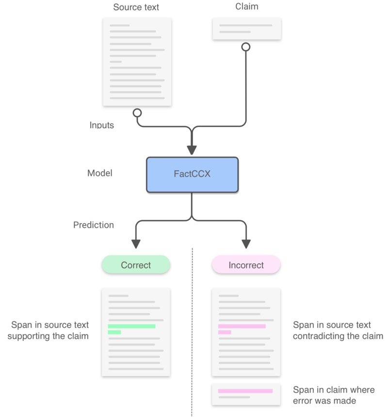

# Evaluating the Factual Consistency of Abstractive Text Summarization
Authors: [Wojciech Kryściński](https://twitter.com/iam_wkr), [Bryan McCann](https://bmccann.github.io/), [Caiming Xiong](http://www.stat.ucla.edu/~caiming/), and [Richard Socher](https://www.socher.org/)

## Introduction
Currently used metrics for assessing summarization algorithms do not account for whether summaries are factually consistent with source documents.
We propose a weakly-supervised, model-based approach for verifying factual consistency and identifying conflicts between source documents and a generated summary.
Training data is generated by applying a series of rule-based transformations to the sentences of source documents.
The factual consistency model is then trained jointly for three tasks:
1) identify whether sentences remain factually consistent after transformation,
2) extract a span in the source documents to support the consistency prediction,
3) extract a span in the summary sentence that is inconsistent if one exists.
Transferring this model to summaries generated by several state-of-the art models reveals that this highly scalable approach substantially outperforms previous models, 
including those trained with strong supervision using standard datasets for natural language inference and fact checking.
Additionally, human evaluation shows that the auxiliary span extraction tasks provide useful assistance in the process of verifying factual consistency.

Paper link: https://arxiv.org/abs/1910.12840

<p align="center"></p>


## Table of Contents

1. [Updates](#updates)
2. [Citation](#citation)
3. [License](#license)
4. [Usage](#usage)
5. [Get Involved](#get-involved)

## Updates
#### 1/27/2020
Updated manually annotated data files - fixed `filepaths` in misaligned examples.

Updated model checkpoint files - recomputed evaluation metrics for fixed examples.

## Citation
```
@article{kryscinskiFactCC2019,
  author    = {Wojciech Kry{\'s}ci{\'n}ski and Bryan McCann and Caiming Xiong and Richard Socher},
  title     = {Evaluating the Factual Consistency of Abstractive Text Summarization},
  journal   = {arXiv preprint arXiv:1910.12840},
  year      = {2019},
}
```


## License
The code is released under the BSD-3 License (see `LICENSE.txt` for details), but we also ask that users respect the following:

This software should not be used to promote or profit from violence, hate, and division, environmental destruction, abuse of human rights, 
or the destruction of people's physical and mental health.


## Usage
Code repository uses `Python 3`.
Prior to running any scripts please make sure to install required Python packages listed in the `requirements.txt` file.

Example call:
`pip3 install -r requirements.txt`

### Training and Evaluation Datasets
Generated training data can be found [here](https://storage.googleapis.com/sfr-factcc-data-research/unpaired_generated_data.tar.gz).

Manually annotated validation and test data can be found [here](https://storage.googleapis.com/sfr-factcc-data-research/unpaired_annotated_data.tar.gz).

Both generated and manually annotated datasets require pairing with the original CNN/DailyMail articles.

To recreate the datasets follow the instructions:
1. Download CNN Stories and Daily Mail Stories from https://cs.nyu.edu/~kcho/DMQA/
2. Create a `cnndm` directory and unpack downloaded files into the directory
3. Download and unpack FactCC data _(do not rename directory)_
4. Run the `pair_data.py` script to pair the data with original articles

Example call:

`python3 data_pairing/pair_data.py <dir-with-factcc-data> <dir-with-stories>`

### Generating Data

Synthetic training data can be generated using code available in the `data_generation` directory.

The data generation script expects the source documents input as one `jsonl` file, where each source document is embedded in a separate json object.
The json object is required to contain an `id` key which stores an example id (uniqness is not required), and a `text` field that stores the text of the source document.

Certain transformations rely on NER tagging, thus for best results use source documents with original (proper) casing.


The following claim augmentations (transformations) are available:
- `backtranslation` - Paraphrasing claim via backtranslation (requires Google Translate API key; costs apply)
- `pronoun_swap` - Swapping a random pronoun in the claim
- `date_swap` - Swapping random date/time found in the claim with one present in the source article
- `number_swap` - Swapping random number found in the claim with one present in the source article
- `entity_swap` - Swapping random entity name found in the claim with one present in the source article
- `negation` - Negating meaning of the claim
- `noise` - Injecting noise into the claim sentence

For a detailed description of available transformations please refer to `Section 3.1` in the paper.

To authenticate with the Google Cloud API follow [these](https://cloud.google.com/docs/authentication/getting-started) instructions.

Example call:

`python3 data_generation/create_data.py <source-data-file> [--augmentations list-of-augmentations]`

### Model Code

`FactCC` and `FactCCX` models can be trained or initialized from a checkpoint using code available in the `modeling` directory.

Quickstart training, fine-tuning, and evaluation scripts are shared in the `scripts` directory.
Before use make sure to update `*_PATH` variables with appropriate, absolute paths.

To customize training or evaluation settings please refer to the flags in the `run.py` file.

To utilize Weights&Biases dashboards login to the service using the following command: `wandb login <API KEY>`.

Trained `FactCC` model checkpoint can be found [here](https://storage.googleapis.com/sfr-factcc-data-research/factcc-checkpoint.tar.gz).

Trained `FactCCX` model checkpoint can be found [here](https://storage.googleapis.com/sfr-factcc-data-research/factccx-checkpoint.tar.gz).

*IMPORTANT:* Due to data pre-processing, the first run of training or evaluation code on a large dataset can take up to a few hours before the actual procedure starts.

#### Running on other data
To run pretrained `FactCC` or `FactCCX` models on your data follow the instruction:
1. Download pre-trained model checkpoint, linked above
2. Prepare your data in `jsonl` format. Each example should be a separate `json` object with `id`, `text`, `claim` keys
representing example id, source document, and claim sentence accordingly. Name file as `data-dev.jsonl`
3. Update corresponding `*-eval.sh` script


## Get Involved

Please create a GitHub issue if you have any questions, suggestions, requests or bug-reports. 
We welcome PRs!
